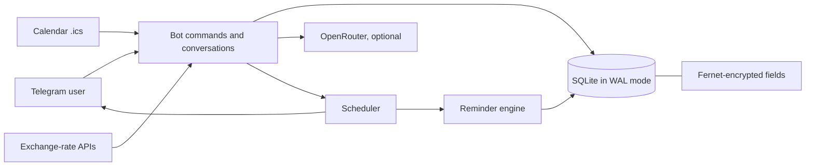

<p align="center">
  
</p>

<h1 align="center">SpendAlert</h1>

<p align="center">
  Self-hosted Telegram bot for recurring bills, tasks and flexible reminders.<br>
  Encrypted local storage, per-user time zones, multi-currency totals, optional AI.
</p>

<p align="center">
  <a href="https://github.com/dekotur/SpendAlert/actions/workflows/ci.yml"></a>
  
  
  
  
  
</p>

<p align="center">
  
</p>

<p align="center">
  <b>English</b> ·
  <a href="README.ru.md">Русский</a>
</p>

<p align="center">
  <a href="#quick-start-python">Quick start</a> ·
  <a href="#run-with-docker">Docker</a> ·
  <a href="#configuration">Configuration</a> ·
  <a href="#how-it-works">Architecture</a> ·
  <a href="docs/reminder-plan.md">Reminder spec</a> ·
  <a href="AGENTS.md">Guide for AI agents</a> ·
  <a href="SECURITY.md">Security</a>
</p>

SpendAlert keeps track of what you owe and what you promised to do. It runs as a
single process, talks to Telegram over long polling, stores everything in a
local SQLite file, and needs no web server, no cloud account and no database
server.

## Why it exists

A reminder-first tool, not another heavyweight personal-finance dashboard. The
point is to capture an obligation in seconds, nag about it on a schedule you
chose, and roll the date forward correctly when it is done.

| Product principle | How it shows up |
|---|---|
| Reliability before magic | Every core flow is a plain command; AI is optional and off by default |
| The user owns the cadence | Reminder plans are per-record, with quiet hours and one-tap snooze |
| Privacy that is visible, not implied | Sensitive fields encrypted, `/privacy` in the bot, user-scoped queries, the external AI provider named out loud |
| Recoverable beats perfect | Every AI mutation takes a per-user snapshot you can roll back |

## Features

- one-off and recurring payments and tasks;
- flexible reminder plans: days before the due date, on the day, and after it;
- snooze, mark paid/done, and quiet hours;
- per-user time zones, reminder hour and list sorting;
- RUB, USD, EUR, GBP, CNY with converted totals;
- calendar import from `.ics` files;
- Fernet encryption for titles, amounts, AI sessions and rollback snapshots;
- optional AI assistant through OpenRouter;
- per-user isolation and undo snapshots;
- runs as plain Python or under Docker Compose.

<details>
<summary><b>What a session looks like</b></summary>

```text
You:  /task
Bot:  📝 New task — Title:
You:  Send the report
Bot:  📅 Date
You:  tomorrow 18:00
Bot:  🔄 Recurrence  →  [🔄 One-off]
Bot:  🔔 When should I remind you?  →  [📅 Due day only] [✅ Done]

You:  /list
Bot:  📋 Tasks
      ⚠️ 1 | Send the report | 23.08.26 18:00 | one-off
```

The hero image above is a concept illustration, not a screenshot: it contains
no user data.

</details>

## Quick start (Python)

You need Git and Python 3.10–3.12. Nothing is installed globally — everything
lands in a virtual environment inside the checkout.

### 1. Get the code

```bash
git clone https://github.com/dekotur/SpendAlert.git
cd SpendAlert
```

### 2. Create a virtual environment

Windows PowerShell:

```powershell
py -3.12 -m venv .venv
.\.venv\Scripts\Activate.ps1
python -m pip install --upgrade pip
python -m pip install --requirement requirements.txt
```

If PowerShell refuses to run the activation script, allow it for this window
only with `Set-ExecutionPolicy -Scope Process Bypass`, then activate again.

Linux/macOS:

```bash
python3 -m venv .venv
source .venv/bin/activate
python -m pip install --upgrade pip
python -m pip install --requirement requirements.txt
```

### 3. Create a Telegram bot

1. Open [@BotFather](https://t.me/BotFather) in Telegram.
2. Send `/newbot` and follow the prompts.
3. Copy the token it gives you. Never commit it or paste it into an issue.

### 4. Configure secrets

Copy the template — it contains no real values:

```bash
cp .env.example .env          # PowerShell: Copy-Item .env.example .env
python scripts/generate_key.py
```

Open `.env` and fill in:

| Key | Value |
|---|---|
| `TELEGRAM_BOT_TOKEN` | the token from BotFather |
| `DB_ENCRYPTION_KEY` | the string the generator just printed |
| `OPENROUTER_API_KEY` | optional, only for `/ai` |
| `ADMIN_CHAT_ID` | optional, enables operational alerts in Telegram |

`DB_ENCRYPTION_KEY` has no recovery path. Store it in a password manager: with a
different key, an existing database can no longer be read.

### 5. Verify the checkout

```bash
python scripts/security_audit.py
python test_bot.py
```

Expected output: `Security audit passed` and `All 52 test groups passed`. The
suite uses a throwaway database and a throwaway key — it never touches your real
data, and it needs no token and no `.env`.

### 6. Run it

```bash
python bot.py
```

Open your bot in Telegram and send `/start`, then `/help`. `Ctrl+C` stops it.

Missing or empty required variables make the process exit immediately with the
names of what is missing, before it ever contacts Telegram.

On first start, runtime files appear next to the code: the SQLite database, a
log, an exchange-rate cache and `backups/`, `data/`, `logs/`. All are listed in
`.gitignore`; set `SPENDALERT_DATA_DIR` to keep them somewhere else.

## First five minutes

Use a throwaway test bot and invented records. Each row below is a full
round-trip you can check by hand:

| Feature | Do this | Expect |
|---|---|---|
| Task with a deadline | `/task` → `Send the report` → `tomorrow 18:00` → `One-off` → pick a plan → `Done` | The task appears in `/list` and nags on the plan you chose |
| Recurring payment | `/add` → `Internet` → `799` → `tomorrow` → `Month` → `Done` | Tapping "Paid" rolls the due date to the next period |
| List and totals | `/list` | Payments and tasks are separated, near-due items highlighted, amounts converted to your currency |
| Snooze | Tap `↪️ +3 hours` or `↪️ Tomorrow` on a reminder | The due time moves; no duplicate record is created |
| Calendar import | Send a synthetic `.ics` file | The event becomes a task at the right local date and time |
| AI assistant | Configure OpenRouter, run `/ai`, then type `what is coming up` | Free-text mode answers from your own records only |

## Run with Docker

Requires Docker Engine and Compose v2.

```bash
cp .env.example .env
docker compose build
docker compose run --rm spendalert python scripts/generate_key.py
```

Put the generated key and your bot token into `.env`, then start the service:

```bash
docker compose up -d
docker compose logs -f spendalert
```

State lives in the named volume `spendalert-data`, mounted at `/data`. To
upgrade:

```bash
git pull --ff-only
docker compose up -d --build
```

`docker compose down` stops the bot and keeps the data. Adding `-v` deletes the
volume, and with it the database.

## Configuration

Everything is read from the environment; `.env` is loaded automatically in
development.

| Variable | Required | Purpose |
|---|:---:|---|
| `TELEGRAM_BOT_TOKEN` | yes | Your bot's token |
| `DB_ENCRYPTION_KEY` | yes | Fernet key for the encrypted SQLite fields |
| `OPENROUTER_API_KEY` | no | Enables the `/ai` assistant |
| `OPENROUTER_MODEL` | no | OpenRouter model id |
| `OPENROUTER_URL` | no | Endpoint of an OpenRouter-compatible API |
| `ADMIN_CHAT_ID` | no | Chat that receives operational alerts |
| `DATABASE_URL` | no | SQLite URL; defaults to a file in the state directory |
| `SPENDALERT_DATA_DIR` | no | Where database, logs, cache and backups live |
| `DB_THREAD_POOL_WORKERS` | no | Size of the blocking DB/file executor (default 32) |
| `BOT_DISK_BUDGET_MB` | no | Footprint budget for alerts; `0` disables the check |
| `DISK_FREE_ALERT_THRESHOLD_MB` | no | Free-space threshold for the disk alert |

Payments, tasks and reminders work with no OpenRouter key at all. Without one,
`/ai` reports an integration error and nothing else changes.

## Commands

| Command | What it does |
|---|---|
| `/start` | Registers the user and shows the short privacy notice |
| `/add` | Adds a payment, step by step |
| `/task` | Adds a task, step by step |
| `/list` | Active records with the nearest due dates |
| `/edit ID` | Changes a record and its reminder plan |
| `/delete ID` | Deletes a record after confirmation |
| `/settings` | Time zone, currency, quiet hours, reminder hour, sorting |
| `/ai` | Turns the persistent AI assistant on or off |
| `/privacy` | Explains what is stored, encrypted and sent where |
| `/help` | Help and examples |

## How it works



| Area | Decision |
|---|---|
| Concurrency | Different chats run in parallel, but updates within one chat stay ordered — required for `ConversationHandler` and `user_data` safety |
| Reminder state | An episode model (`n0..n3 / due / overdue`) where only an actual send advances the counter, so a recompute cannot resurrect an exhausted wave — see [docs/reminder-plan.md](docs/reminder-plan.md) |
| Storage | SQLite in WAL mode, short transactions, a relocatable state directory, daily and per-user snapshots |
| Data protection | Titles, amounts, AI sessions and snapshots are Fernet-encrypted; the key lives only in the environment |
| Optional AI | OpenRouter receives the current user's scoped context and nothing else; manual commands never depend on it |
| Publication safety | CI runs the tests, the linter and a repository secret audit; Dependabot tracks Python, Actions and Docker updates |

| Module | Responsibility |
|---|---|
| `bot.py` | Telegram application: commands, conversations, callbacks, AI routing |
| `database.py` | SQLAlchemy models, migrations, user isolation, snapshots |
| `scheduler.py` | APScheduler jobs and reminder delivery |
| `reminder_plan.py` | Pure reminder-plan model and validation |
| `reminder_engine.py` | Episode calculation and persisted schedule state |
| `ai_handler.py` | Optional OpenRouter tool loop and user-scoped context |
| `crypto_utils.py` | Fernet field encryption |
| `ics_import.py` | Bounded `.ics` parsing |
| `currency.py` | Exchange-rate cache and conversion |
| `utils.py`, `config.py` | Dates and time zones; environment contract and paths |
| `test_bot.py` | Self-contained 52-group regression suite |

### Deliberate limits

- single-instance self-hosted app, not a horizontally scalable SaaS;
- dates and scheduling metadata are not encrypted — the scheduler needs to query
  them by time;
- AI mode sends the context described in `/privacy` to an external provider;
- Telegram long polling only: no webhook deployment and no web UI.

## Data and privacy

By default the database (`spendalert.db`), logs, exchange-rate cache and backups
are created in the project directory; `SPENDALERT_DATA_DIR` moves all runtime
state elsewhere, and the Docker image uses `/data`.

SQLite runs in WAL mode. Sensitive text and numeric fields are encrypted with
the Fernet key from the environment. Dates and scheduling metadata stay in
plaintext because the scheduler queries them on every sweep.

Back up the state directory **and** the value of `DB_ENCRYPTION_KEY`. Either one
alone cannot restore anything.

Self-hosted does not mean zero-knowledge: the running process decrypts data to
build a reminder, and with `/ai` enabled the message plus the necessary context
goes to OpenRouter. Telegram sees messages as the transport. The bot tells users
the same thing through `/privacy`. If you operate a shared instance, its privacy
policy, key handling, backups and legal compliance are yours to own.

## Troubleshooting

**It exits immediately.** `.env` must be in the project root, and both required
variables must be filled in without quotes or stray spaces around the name.

**Telegram rejected the token.** The bot exits with that message when the
token is wrong. Copy it again from BotFather, with no quotes and no spaces
around it, and make sure the bot has not been deleted there.

**`InvalidToken` when reading the database.** The `DB_ENCRYPTION_KEY` differs
from the one the database was created with. Restore the original key —
generating a new one cannot decrypt old rows.

**Telegram returns `Conflict`.** Two processes are polling the same token. Stop
the extra local or Docker instance.

**`/ai` does not answer.** Check `OPENROUTER_API_KEY`, your account balance and
the availability of the selected model. Nothing else depends on OpenRouter.

**Time zones are not found on Windows.** Install dependencies from
`requirements.txt`: `tzdata` is pinned there explicitly.

## Development

```bash
python -m pip install --requirement requirements-dev.txt
ruff check .
python scripts/security_audit.py
python test_bot.py
python -m compileall -q .
```

CI runs the linter, the secret audit, and the full suite on Python 3.10 and
3.12. Contribution rules are in [CONTRIBUTING.md](CONTRIBUTING.md); coding
agents get their own contract in [AGENTS.md](AGENTS.md). Report vulnerabilities
through [SECURITY.md](SECURITY.md), never in a public issue.

Before every push:

```bash
python scripts/security_audit.py && python test_bot.py && ruff check .
git status --short
```

Read that `git status` output. Never `git add .` unchecked. And if a token or key
ever does land in a commit, deleting the line in the next commit does not make it
safe — revoke and rotate the credential first.

To upgrade an existing Python install:

```bash
git pull --ff-only
python -m pip install --requirement requirements.txt
python test_bot.py
python bot.py
```

Stop the old process and keep a copy of the state directory and the encryption
key before upgrading.

## License

[MIT](LICENSE)
