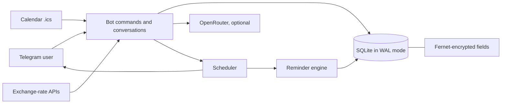

<p align="center">
  
</p>

<h1 align="center">SpendAlert</h1>

<p align="center">
  Self-hosted Telegram-бот для регулярных платежей, задач и гибких напоминаний.<br>
  Зашифрованное локальное хранилище, часовые пояса, валюты и опциональный ИИ-помощник.
</p>

<p align="center">
  <a href="https://github.com/dekotur/SpendAlert/actions/workflows/ci.yml"></a>
  
  
  
  
  
</p>

<p align="center">
  
</p>

<p align="center">
  <a href="README.md">English</a> ·
  <b>Русский</b>
</p>

<p align="center">
  <a href="#быстрый-старт-python">Быстрый старт</a> ·
  <a href="#запуск-в-docker">Docker</a> ·
  <a href="#настройки">Настройки</a> ·
  <a href="#как-это-устроено">Архитектура</a> ·
  <a href="docs/reminder-plan.md">Спека напоминаний</a> ·
  <a href="AGENTS.md">Гайд для ИИ-агентов</a> ·
  <a href="SECURITY.md">Security</a>
</p>

SpendAlert помогает не забывать про оплаты и обещания. Это один процесс: он
работает с Telegram через long polling, хранит всё в локальном файле SQLite и не
требует ни веб-сервера, ни облачного аккаунта, ни отдельной СУБД.

> **Интерфейс бота — английский**, как и код, документация и настройки. Этот
> файл — перевод README для русскоязычного читателя, а не признак того, что бот
> говорит по-русски.

## Зачем это нужно

Это reminder-first инструмент, а не ещё одна тяжёлая система финансовой
аналитики. Цель — за секунды зафиксировать обязательство, напомнить о нём по
выбранному вами плану и корректно перенести срок после выполнения.

| Product principle | Как проявляется |
|---|---|
| Надёжность раньше «магии» | Все ключевые сценарии — обычные команды; ИИ опционален и по умолчанию выключен |
| Частотой управляет пользователь | План напоминаний задаётся для каждой записи, есть тихие часы и перенос в один тап |
| Privacy видна, а не подразумевается | Шифрование чувствительных полей, `/privacy`, user-scoped запросы и прямо названный внешний AI-провайдер |
| Восстановимость важнее идеала | Перед каждым AI-изменением создаётся пользовательский снимок для отката |

## Возможности

- разовые и повторяющиеся платежи и задачи;
- гибкий план напоминаний: заранее, в день срока и после просрочки;
- перенос срока, отметка «оплачено/выполнено» и тихие часы;
- индивидуальные часовые пояса, время напоминаний и сортировка списка;
- RUB, USD, EUR, GBP и CNY с конвертацией итогов;
- импорт событий из файлов `.ics`;
- шифрование Fernet для названий, сумм, AI-сессий и снимков;
- опциональный ИИ-помощник через OpenRouter, в том числе голосовые сообщения;
- изоляция пользователей и снимки для отмены изменений;
- запуск обычным Python или через Docker Compose.

<details>
<summary><b>Как выглядит диалог</b></summary>

```text
Вы:  /task
Бот: 📝 New task — Title:
Вы:  Send the report
Бот: 📅 Date
Вы:  tomorrow 18:00
Бот: 🔄 Recurrence  →  [🔄 One-off]
Бот: 🔔 When should I remind you?  →  [📅 Due day only] [✅ Done]

Вы:  /list
Бот: 📋 Tasks
     ⚠️ 1 | Send the report | 23.08.26 18:00 | one-off
```

Картинка в шапке — концептуальная иллюстрация, а не скриншот: пользовательских
данных в ней нет.

</details>

## Быстрый старт (Python)

Нужны Git и Python 3.10–3.12. Глобально ничего не устанавливается — всё
попадает в виртуальное окружение внутри копии репозитория.

### 1. Получите код

```bash
git clone https://github.com/dekotur/SpendAlert.git
cd SpendAlert
```

### 2. Создайте виртуальное окружение

Windows PowerShell:

```powershell
py -3.12 -m venv .venv
.\.venv\Scripts\Activate.ps1
python -m pip install --upgrade pip
python -m pip install --requirement requirements.txt
```

Если PowerShell запрещает запуск скрипта активации, разрешите его только для
текущего окна командой `Set-ExecutionPolicy -Scope Process Bypass` и повторите
активацию.

Linux/macOS:

```bash
python3 -m venv .venv
source .venv/bin/activate
python -m pip install --upgrade pip
python -m pip install --requirement requirements.txt
```

### 3. Создайте Telegram-бота

1. Откройте [@BotFather](https://t.me/BotFather) в Telegram.
2. Отправьте `/newbot` и завершите диалог.
3. Скопируйте выданный token. Не коммитьте его и не вставляйте в issue.

### 4. Заполните секреты

Скопируйте шаблон — реальных значений в нём нет:

```bash
cp .env.example .env          # PowerShell: Copy-Item .env.example .env
python scripts/generate_key.py
```

Откройте `.env` и заполните:

| Ключ | Значение |
|---|---|
| `TELEGRAM_BOT_TOKEN` | token из BotFather |
| `DB_ENCRYPTION_KEY` | строка, которую только что вывел генератор |
| `OPENROUTER_API_KEY` | необязательно, нужен только для `/ai` |
| `ADMIN_CHAT_ID` | необязательно, включает служебные алерты в Telegram |

У `DB_ENCRYPTION_KEY` нет пути восстановления. Сохраните его в менеджере
паролей: с другим ключом существующая база больше не читается.

### 5. Проверьте установку

```bash
python scripts/security_audit.py
python test_bot.py
```

Ожидаемый вывод: `Security audit passed` и `All 58 test groups passed`. Тесты
работают на временной базе с временным ключом — реальные данные они не трогают,
token и `.env` им не нужны.

### 6. Запустите

```bash
python bot.py
```

Откройте своего бота в Telegram и отправьте `/start`, затем `/help`. Остановить
процесс — `Ctrl+C`.

Если обязательные переменные не заданы, процесс завершится сразу и напишет,
чего именно не хватает, ещё до обращения к Telegram.

При первом старте рядом с кодом появятся runtime-файлы: база SQLite, лог, кэш
курсов и каталоги `backups/`, `data/`, `logs/`. Все они перечислены в
`.gitignore`; переменная `SPENDALERT_DATA_DIR` переносит их в другое место.

## Первые пять минут

Используйте отдельного тестового бота и вымышленные записи. Каждая строка —
полный сценарий, который можно проверить руками:

| Возможность | Что сделать | Что должно произойти |
|---|---|---|
| Задача с дедлайном | `/task` → `Send the report` → `tomorrow 18:00` → `One-off` → выбрать план → `Done` | Задача появится в `/list` и будет напоминать по выбранному плану |
| Повторяющийся платёж | `/add` → `Internet` → `799` → `tomorrow` → `Month` → `Done` | После кнопки «Paid» срок перенесётся на следующий период |
| Список и суммы | `/list` | Платежи и задачи разделены, ближайшие сроки подсвечены, суммы пересчитаны в вашу валюту |
| Перенос напоминания | Нажать `↪️ +3 hours` или `↪️ Tomorrow` в напоминании | Срок сдвинется, дубль записи не появится |
| Импорт календаря | Отправить синтетический `.ics` | Событие станет задачей с правильной локальной датой и временем |
| ИИ-помощник | Настроить OpenRouter, вызвать `/ai`, написать `what is coming up` | Free-text режим ответит только по вашим записям |
| Голосовое сообщение | При включённом `/ai` зажать микрофон и сказать `task doctor tomorrow` | Голосовое расшифровывается и обрабатывается как те же слова, набранные текстом |

## Запуск в Docker

Нужны Docker Engine и Compose v2.

```bash
cp .env.example .env
docker compose build
docker compose run --rm spendalert python scripts/generate_key.py
```

Впишите ключ и token бота в `.env`, затем поднимите сервис:

```bash
docker compose up -d
docker compose logs -f spendalert
```

Состояние живёт в именованном volume `spendalert-data`, смонтированном в
`/data`. Обновление:

```bash
git pull --ff-only
docker compose up -d --build
```

`docker compose down` останавливает бота и сохраняет данные. Флаг `-v` удалит
volume вместе с базой.

## Настройки

Всё читается из окружения; в разработке `.env` подхватывается автоматически.

| Переменная | Обязательна | Назначение |
|---|:---:|---|
| `TELEGRAM_BOT_TOKEN` | да | Token вашего бота |
| `DB_ENCRYPTION_KEY` | да | Fernet-ключ для зашифрованных полей SQLite |
| `OPENROUTER_API_KEY` | нет | Включает ИИ-помощника `/ai` |
| `OPENROUTER_MODEL` | нет | Идентификатор модели OpenRouter |
| `OPENROUTER_URL` | нет | Endpoint OpenRouter-совместимого API |
| `OPENROUTER_STT_MODEL` | нет | Модель распознавания речи для голосовых |
| `OPENROUTER_TRANSCRIBE_URL` | нет | Endpoint API распознавания речи |
| `ADMIN_CHAT_ID` | нет | Чат, получающий служебные алерты |
| `DATABASE_URL` | нет | SQLite URL; по умолчанию файл в каталоге состояния |
| `SPENDALERT_DATA_DIR` | нет | Где лежат база, логи, кэш и резервные копии |
| `DB_THREAD_POOL_WORKERS` | нет | Размер пула блокирующих DB/file операций (по умолчанию 32) |
| `BOT_DISK_BUDGET_MB` | нет | Лимит размера данных для алерта; `0` отключает проверку |
| `DISK_FREE_ALERT_THRESHOLD_MB` | нет | Порог свободного места для алерта |

Платежи, задачи и напоминания работают вообще без ключа OpenRouter. Без него
`/ai` сообщит об ошибке интеграции, остальное не изменится. Голосовые
используют тот же ключ и тот же баланс, что и текстовые запросы.

## Команды

| Команда | Что делает |
|---|---|
| `/start` | Регистрирует пользователя и показывает краткую privacy-информацию |
| `/add` | Добавляет платёж по шагам |
| `/task` | Добавляет задачу по шагам |
| `/list` | Активные записи и ближайшие сроки |
| `/edit ID` | Меняет запись и её план напоминаний или удаляет её |
| `/delete ID` | Удаляет запись после подтверждения |
| `/settings` | Часовой пояс, валюта, тихие часы, время напоминаний, сортировка |
| `/ai` | Включает или выключает постоянного ИИ-помощника. Пока он включён, до него доходят и обычные, и голосовые сообщения |
| `/privacy` | Объясняет, что хранится, что шифруется и что куда отправляется |
| `/help` | Справка и примеры |

## Как это устроено



| Область | Решение |
|---|---|
| Concurrency | Разные чаты выполняются параллельно, но updates одного чата остаются последовательными — иначе ломаются `ConversationHandler` и `user_data` |
| Reminder state | Эпизодная модель (`n0..n3 / due / overdue`), где счётчик двигает только фактическая отправка: recompute не может воскресить исчерпанную волну — см. [docs/reminder-plan.md](docs/reminder-plan.md) |
| Storage | SQLite в WAL-режиме, короткие транзакции, переносимый каталог состояния, ежедневные и user-scoped снимки |
| Data protection | Названия, суммы, AI-сессии и снимки шифруются Fernet; ключ живёт только в окружении |
| Optional AI | OpenRouter получает контекст только текущего пользователя; ручные команды от него не зависят |
| Голосовой ввод | Доступен только при уже включённом помощнике: лимит запросов списывается до скачивания аудио, поэтому распознаванием нельзя получить бесплатный вызов |
| Publication safety | CI гоняет тесты, линтер и secret audit; Dependabot следит за Python, Actions и Docker |

| Модуль | Ответственность |
|---|---|
| `bot.py` | Telegram-приложение: команды, диалоги, callbacks, роутинг AI |
| `database.py` | Модели SQLAlchemy, миграции, изоляция пользователей, снимки |
| `scheduler.py` | Задания APScheduler и доставка напоминаний |
| `reminder_plan.py` | Чистая модель плана напоминаний и валидация |
| `reminder_engine.py` | Расчёт эпизодов и сохранённое состояние расписания |
| `ai_handler.py` | Опциональный tool-loop OpenRouter, распознавание речи и user-scoped контекст |
| `crypto_utils.py` | Шифрование полей через Fernet |
| `ics_import.py` | Ограниченный по размеру парсинг `.ics` |
| `currency.py` | Кэш курсов и конвертация валют |
| `utils.py`, `config.py` | Даты и часовые пояса; контракт окружения и пути |
| `test_bot.py` | Автономный regression-набор из 58 групп |

### Осознанные ограничения

- это single-instance self-hosted приложение, а не horizontally scalable SaaS;
- даты и metadata расписания не шифруются — планировщику нужны запросы по
  времени;
- в режиме AI наружу уходит контекст, описанный в `/privacy`;
- только Telegram long polling: ни webhook-деплоя, ни веб-интерфейса.

## Данные и приватность

По умолчанию база (`spendalert.db`), логи, кэш курсов и резервные копии
создаются в каталоге проекта; `SPENDALERT_DATA_DIR` переносит всё
runtime-состояние в другое место, Docker-образ использует `/data`.

SQLite работает в WAL-режиме. Чувствительные текстовые и числовые поля
шифруются Fernet-ключом из окружения. Даты и служебные поля расписания
остаются открытыми, потому что планировщик запрашивает их на каждом проходе.

Делайте резервную копию каталога данных **и** значения `DB_ENCRYPTION_KEY`.
Одно без другого ничего не восстановит.

Self-hosted не значит zero-knowledge: работающий процесс расшифровывает данные,
чтобы собрать напоминание, а при включённом `/ai` сообщение и нужный контекст
уходят в OpenRouter — у голосового сообщения туда же уходит и сама запись
звука, чтобы её расшифровать. Аудио передаётся потоком и на диск не пишется.
Telegram видит сообщения как транспорт. То же самое бот объясняет
пользователю через `/privacy`. Если вы держите общий инстанс — его
privacy policy, хранение ключей, бэкапы и соответствие законодательству ваши.

## Частые проблемы

**Бот сразу завершился.** `.env` должен лежать в корне проекта, а обе
обязательные переменные — быть заполнены без кавычек и пробелов вокруг имени.

**Telegram отклонил token.** Бот завершится с этим сообщением, если token
неверный. Скопируйте его из BotFather заново — без кавычек и пробелов вокруг —
и проверьте, что бот там не удалён.

**`InvalidToken` при чтении базы.** `DB_ENCRYPTION_KEY` отличается от того, с
которым база создавалась. Верните исходный ключ — новый не расшифрует старые
строки.

**Telegram отвечает `Conflict`.** Один token опрашивают два процесса.
Остановите лишний локальный или Docker-инстанс.

**`/ai` не отвечает.** Проверьте `OPENROUTER_API_KEY`, баланс и доступность
выбранной модели. Ничего другого от OpenRouter не зависит.

**На голосовое нет ответа.** Сначала должен быть включён помощник: отправьте
`/ai` и запишите заново. Если открыт шаг `/add`, `/task`, `/edit` или
`/settings`, бот об этом скажет — завершите его или `/cancel`. Голосовые
больше 2 МБ отклоняются, а для распознавания нужен тот же ключ OpenRouter,
что и для текста.

**Часовые пояса не находятся на Windows.** Установите зависимости из
`requirements.txt`: `tzdata` там закреплён явно.

## Разработка

```bash
python -m pip install --requirement requirements-dev.txt
ruff check .
python scripts/security_audit.py
python test_bot.py
python -m compileall -q .
```

CI прогоняет линтер, secret audit и полный набор тестов на Python 3.10 и 3.12.
Правила для pull request — в [CONTRIBUTING.md](CONTRIBUTING.md), контракт для
ИИ-агентов — в [AGENTS.md](AGENTS.md). Об уязвимости сообщайте по
[SECURITY.md](SECURITY.md), а не через публичный issue.

Перед каждым push:

```bash
python scripts/security_audit.py && python test_bot.py && ruff check .
git status --short
```

Читайте вывод `git status`. Никогда не делайте `git add .` не глядя. И если
token или ключ всё-таки попал в commit — удаление строки в следующем коммите не
делает его безопасным: сначала отзовите и замените credential.

Обновление существующей Python-установки:

```bash
git pull --ff-only
python -m pip install --requirement requirements.txt
python test_bot.py
python bot.py
```

Перед обновлением остановите старый процесс и сохраните каталог данных вместе с
ключом шифрования.

## Лицензия

[MIT](LICENSE)
